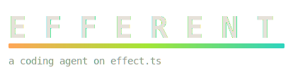

<p align="center">
  
</p>

> **A family of purpose-built agents on a shared Effect.ts kernel** — a spec-driven coder, a server-graded math tutor, a gated page builder, a human-approved social drafter — built to one doctrine: *Agent = Model + Harness*. Validation and looping are **enforced in deterministic code, never advisory**; the gates declare victory, not the model; how much autonomy each agent earns is set by the strength of its validation oracle.

> [!WARNING]
> **This repo is in a high state of flux.** It's built in public and moving fast — package layout, commands, settings, and docs can change or break between commits without notice, and `main` is not guaranteed stable. The previously published npm packages (`efferent`, `@xandreed/cli`) are the **frozen previous line** and no longer receive updates — everything current is **source-run** with Bun.

**Docs site:** [xandreeddev.github.io/efferent](https://xandreeddev.github.io/efferent/) · getting started, the concepts, and one page per agent.

## The line

```
packages/
├── foundry/      THE FACTORY — forge loop (implement → snapshot → gate pipeline →
│                 typed feedback → retry) + static-analysis gates + ratchet baselines
├── engine/       the agent KERNEL (pure; effect + @effect/ai only): the loop as an
│                 Effect.iterate fold, ports, prompt mapping, within-run compaction,
│                 the MCP bridge, the session chassis, the SpecDoc
├── providers/    the EDGE: routed LanguageModel (per-call re-resolution), SQLite
│                 store, auth/settings, MCP stdio client, sandboxed shell (bwrap)
├── surface/      the UI substrate: html template, allowlist sanitizer, UI gates
├── smith/        the CODER at the forge — refine a spec WITH the human, :lock it,
│                 forge under gates; skills, workspace memory, judge gate, :ship
├── math/         the tutor — authors exercises, the SERVER grades them
├── canvas/       the page builder — gated HTML is the only output channel
├── social/       the drafter — a human approves everything outbound
└── scenarios/    evals v3 — scenario packs over agent worlds, committed baselines
```

Dependency direction is **a build-failing gate**, not a convention: engine/surface/foundry import nothing internal; providers → engine; each agent → its substrate; nothing imports scenarios.

## The doctrine

- **The gate declares victory.** A coder's turn ends in a snapshot judged by a staged pipeline — static rules → typecheck → tests → the spec's own accept commands → an LLM judge *last* (intent + honesty only, fail-closed). A rejected run is a result with typed findings that brief the next attempt, not an error.
- **Fail-closed everywhere.** A gate that cannot run is a failure, never a silent pass.
- **Errors are values, state is a fold.** No `try`/`catch`, no `let`, no loops, `Option` for absence, `Match` for unions — enforced by the repo's own gates at a **zero baseline**: one new violation anywhere fails `bun run typecheck`.
- **The harness compounds.** Workspace rules files reach every brief; gate history distills into lessons; an LLM-curated memory ledger survives across runs; repeatedly-confirmed memories graduate into skills the agent loads on demand.

## Run the agents

Credentials live in `~/.efferent/auth.json` (write them with smith's `:login`); model selection in `.efferent/config.json` (`"model": "<provider>:<modelId>"` + `codeModel`/`fastModel` roles). Requires [Bun](https://bun.sh) ≥ 1.2 — no build step, Bun runs the TypeScript directly.

```bash
git clone https://github.com/xandreeddev/efferent && cd efferent && bun install

bun run smith --cwd <dir>       # the coder: dashboard → refine → :lock → :forge → :ship
bun run math --open             # the practice product (loopback + token)
bun run canvas --open           # the page builder (loopback)
bun run social review           # the human review queue
bun run scenarios               # the regression batteries (key-free, scripted twins)
bun run foundry demo            # the forge-loop E2E, no keys needed
```

## smith in one minute

```
$ bun run smith --cwd ~/code/toy

> a stats module with tests          # describe the idea
  … the refiner drafts a SpecDoc — goal, acceptance, machine checks
:lock                                # only the human locks a spec
:forge                               # implement → snapshot → gates → feedback → retry
  ✓ typecheck  ✓ bun-test  ✓ accept-stats-tests  ✓ judge
  ✓ ACCEPTED · artifact .foundry/runs/<id>.json
:ship                                # branch → commit → push → PR
```

Under the hood: the coder runs unattended with read/write/edit/Bash (Bash inside a **bubblewrap sandbox**, workspace-rw/root-ro), discovers workspace **skills** by progressive disclosure, reaches user-configured **MCP servers** through `mcp_describe`/`mcp_call`, folds its own context past 80k tokens, and leaves an auditable conversation in `.efferent/smith.db` that the scenario packs read as evidence.

## Develop

```bash
bun run typecheck     # tsc + foundry self-check + the zero-baseline repo gate suite
bun test              # colocated unit tests, key-free
bun run scenarios     # scenario packs vs committed baselines
```

CI runs all three plus the forge-loop E2E. The repo's own gates run on the repo's own source — a banned construct in any package fails the build.

## Docs

- **[the docs site](https://xandreeddev.github.io/efferent/)** — getting started, concepts, the agents.
- **[`docs/foundry.md`](./docs/foundry.md)** — the factory design (loop, gates, ratchet).
- **[`docs/evals-v3.md`](./docs/evals-v3.md)** — the scenario-pack eval design.
- **[`docs/roadmap.md`](./docs/roadmap.md)** — what's not built yet, and what's consciously skipped.
- **[`docs/agents/`](./docs/agents)** — the agent-line plan docs.

## Tech

`effect` · `@effect/ai` · Bun (runtime + test runner + SQLite) · `@opentui/core` + `@opentui/solid` + `solid-js` (the TUI — no React, no Ink) · htmx + Alpine.js behind a sanitizer (the web surfaces) · bubblewrap (the coder's sandbox) · OTLP + Grafana (observability).

## License

[MIT](./LICENSE)
