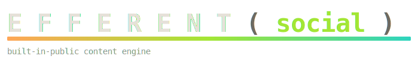

  

# @efferent/social

> The built-in-public content engine — the agent reads its own blog and codebase, finds places worth engaging, and drafts/queues social posts for review.

A driver-level package on the same stack as the rest of efferent (`@efferent/sdk-core` + `@efferent/sdk-adapters`, an `@effect/ai` `Toolkit`, `@effect/cli` entrypoint). Browser automation is Playwright; everything domain-shaped is an Effect over a port.

## What's inside

- **`socialToolkit.ts`** — the `@effect/ai` `Toolkit` the agent drives (read the blog, find opportunities, queue a post for review).
- **`ports/` + `adapters/`** — the platform seams: `XPlatform` / `PlaywrightXPlatform.ts` (X via a persisted browser session), `BlogReader` / `AstroBlogReader.ts` (the Astro blog as a source).
- **`opportunityFinder.ts`** — surfaces threads/posts worth a substantive reply.
- **`reviewQueue.ts`** — nothing posts unattended; drafts land in a queue for human review.
- **`scheduler.ts`** — paces the cadence.

> **OPSEC:** this package operates the `@xandreeddev` alias. Browser sessions and credentials are alias-bound and never committed.

Part of [**efferent**](../../README.md) — a coding agent on Effect.ts + Bun.
